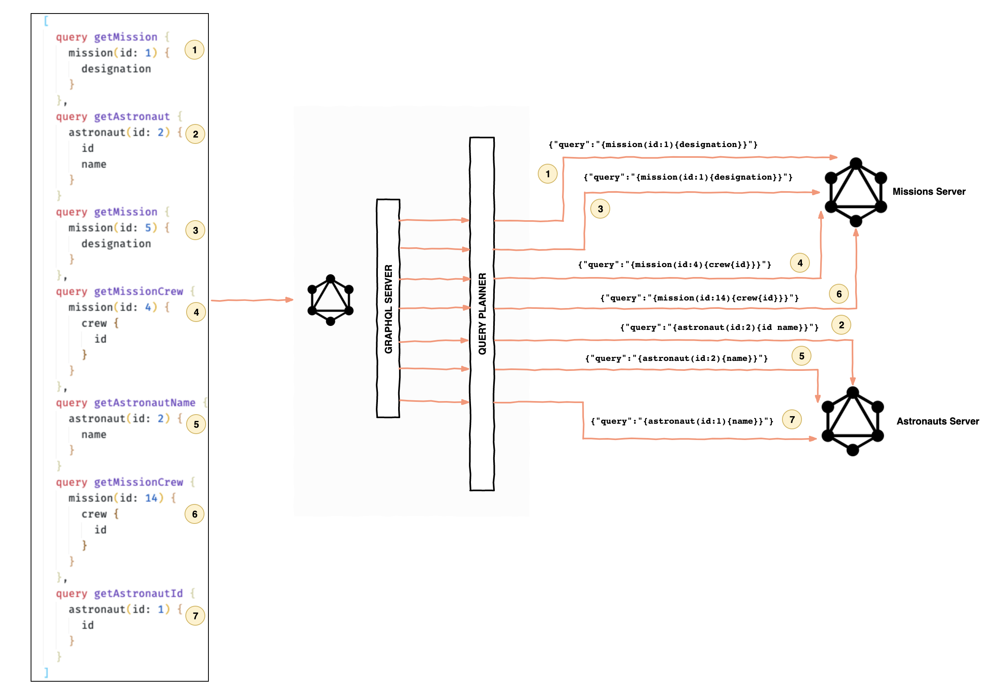
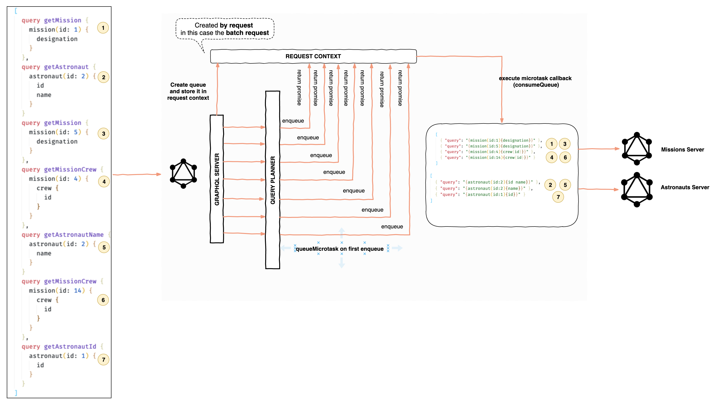
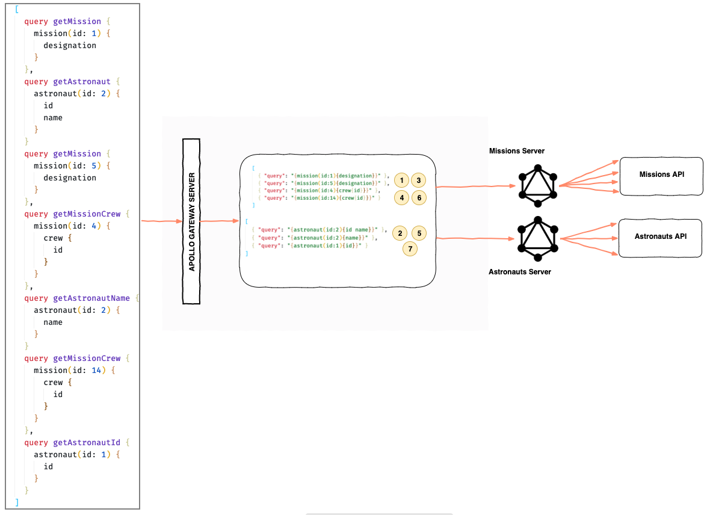
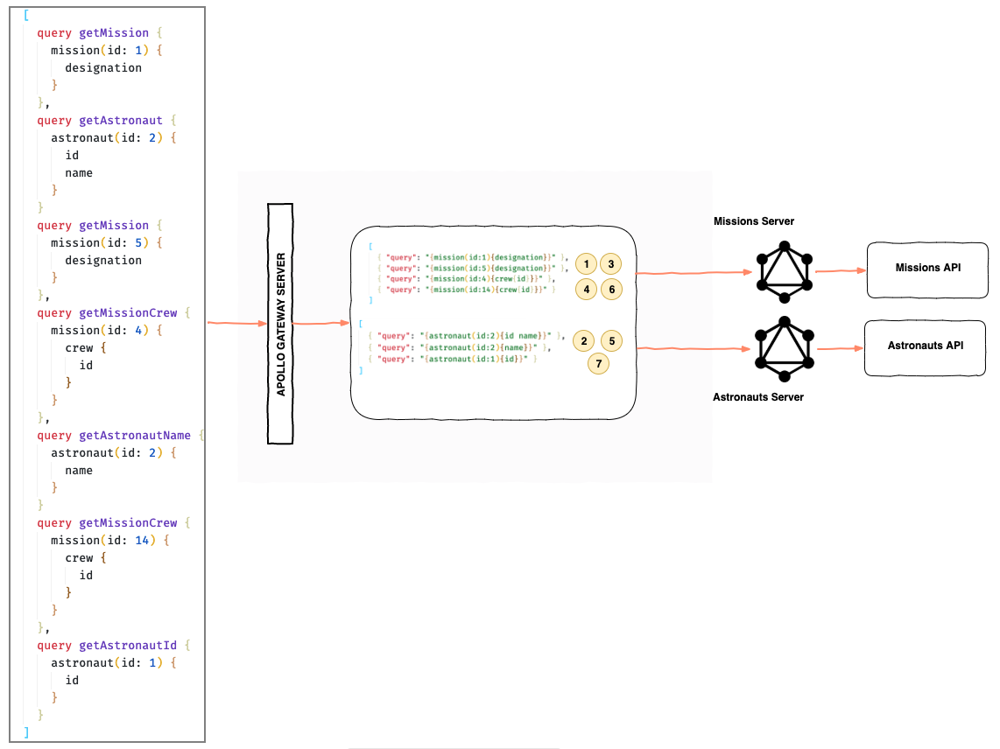

# Batching from Gateway to Subgraphs and Subgraphs to data sources

Forked repository from https://github.com/mandiwise/space-camp-federation-demo, 

- Adding a custom data source to allow batching from gateway to subgraphs.
- Adding dataloaders in subgraphs to allow batching to data sources (downstream services).

**Installation:**

```sh
npm i
```

1. Without Batching in Gateway
```sh
npm run server-gateway-datasource
```

2. Batching in Gateway to subgraphs using a custom Batch DataSource
```sh
npm run server-gateway-batch-datasource
```

2. Batching in Gateway to subgraphs using a custom ApolloLink
```sh
npm run server-gateway-batch-apollo-link
```

Gateway Server

https://localhost:4000

Astronauts Server

https://localhost:4001

Missions Server

https://localhost:4002

# Example


## Gateway Layer

Given a gateway with 2 GraphQL Services: `Missions` and `Astronauts`, if we send a batched request with **7 operations** and gateway to the gateway and the gateway does not allow batching to subgrapghs a total of **7 requests** will be sent from gateway to subgraphs:

- **4 requests** to the `Missions` GraphQL service
- **3 requests** to the `Astronauts` GraphQL Service.



if we enable batching in the gateway a single batched request of **7 operations** will be reduced to **2 requests** sent to the downstream services.

- **1 batch request with 4 operations** to the `Missions` GraphQL service
- **1 batch request with 3 operations ** to the `Astronauts` GraphQL Service.



## Subgrapghs Layer

If subgraphs don't apply batching and deduplication on resolvers, the subgraphs will be doing multiple roundtrips to the data sources.



If subgraphs apply batching and deduplication with DataLoaders on resolvers, the subgraphs will be doing only 1 roundtrip to the data sources.


